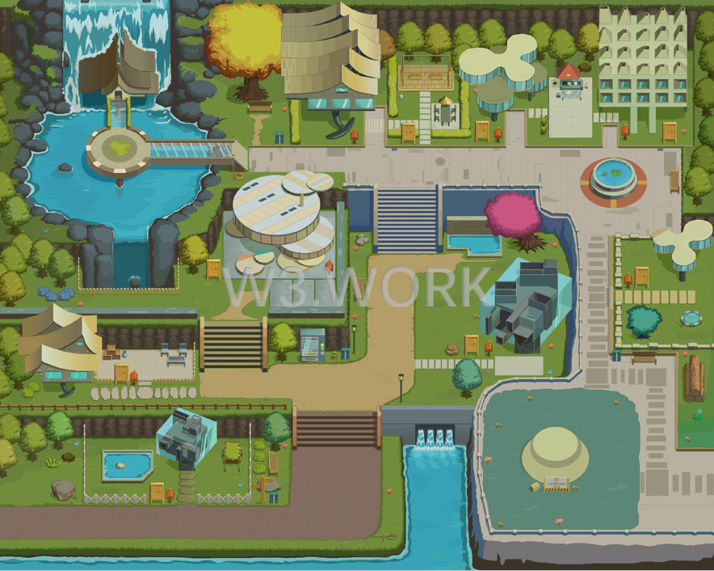

# ⛩ Welcome to W3space

W3space Asset Management is creating the HeadQuarters in Metaverse, which is a unique virtual commercial space where users can truly own, build & construct, and enjoy hanging out in their own space, and engaging with their community. **From the community, For the Community.**

Owners of W3space units will be able to work, connect, socialize, collab with each other, and participate in a variety of entertaining activities within the W3work Metaverse.&#x20;

W3space unit owners will also be able to participate in W3space governance through a Decentralized Autonomous Organization (DAO), where they will be able to exercise voting rights on critical W3space future ecosystem decisions.&#x20;

Authorized W3space developers can create digital assets (also known as Non-Fungible Tokens, or NFTs) and upload them to the marketplace.&#x20;

W3space intends to build a combination of casual and official business environments for Web3.0 communities, including Web3.0 firms, Venture Capitalists, Indie Creators, Freelancers, Investors, and others, by offering Web3.0 decentralized social graphs, WorkFi Economics, and "Chain-less" experience.
