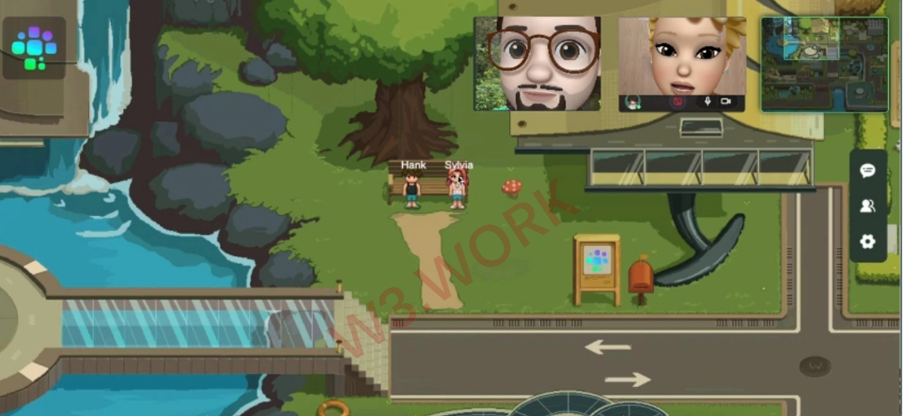
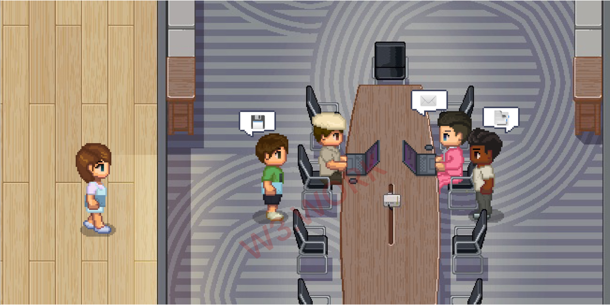
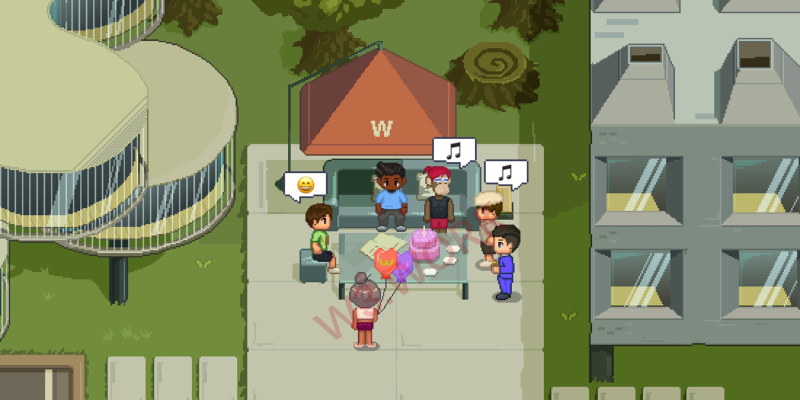
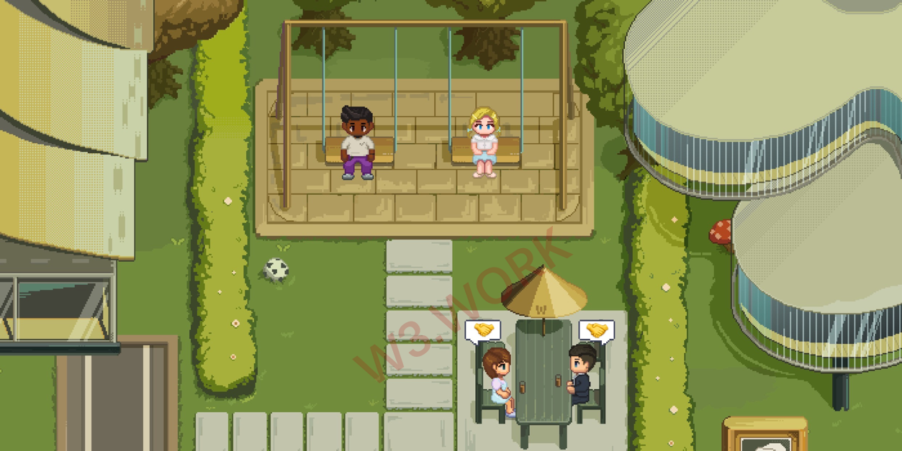

# 💻 Experiences in W3space

<figure><figcaption></figcaption></figure>

You'll be able to communicate and connect with other Web3.0 professionals while you're in W3space.

Hop on a community call whenever you'd like, you'll never feel alone in Web3. Playing video games with other community members, and immerse yourself in different kinds of community cultures to feel the magic of Web3 space.

If you find someone you wish to talk to in the open area, simply approach them and an A/V chat will begin automatically, assuming both sides allow A/V access. While neither party wants to continue the conversation, simply walking away would end it. If you don't want to be bothered by others, you might use invisibility cloaks to enable Ghost Mode.

You can host meetings, have 1v1 private talks with your coworkers, and have alone time to focus on your project while inside your company office.&#x20;

Rooftops and mini-bars are usually fun places to meet new people and bond with old ones.

You may also schedule a guest visit to another company in W3space at a certain time.

