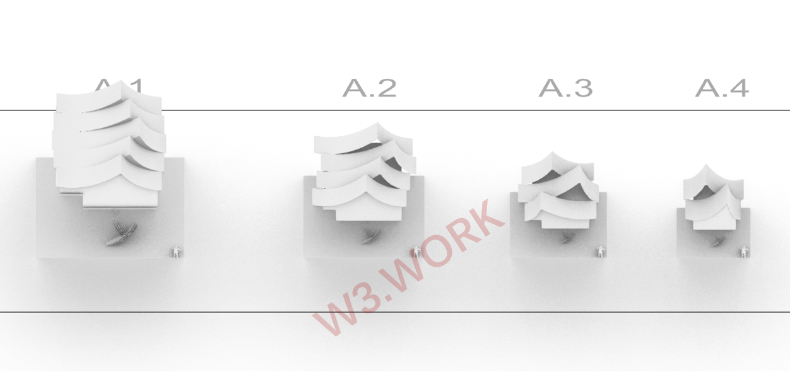

# 🗺 The Map

W3space resort units are blockchain-backed virtual tokens that represent physical parcels of the W3space Asset Management property (using the ERC-721 standard for NFTs).&#x20;

W3space Resort is based on a map with **11,111 office units.** Users truly own resort units in the W3space Metaverse, which they can use to work, build, connect, hype, collab and monetize.&#x20;

Office units are used as virtual office spaces for your team to immersively work remotely, interact with community and collaborate with one another or can be rented to other Web3.0 teams.&#x20;

Every office comes with a set of prebuilt terrains that the owner or resident can terraform, renovate, and decorate.
