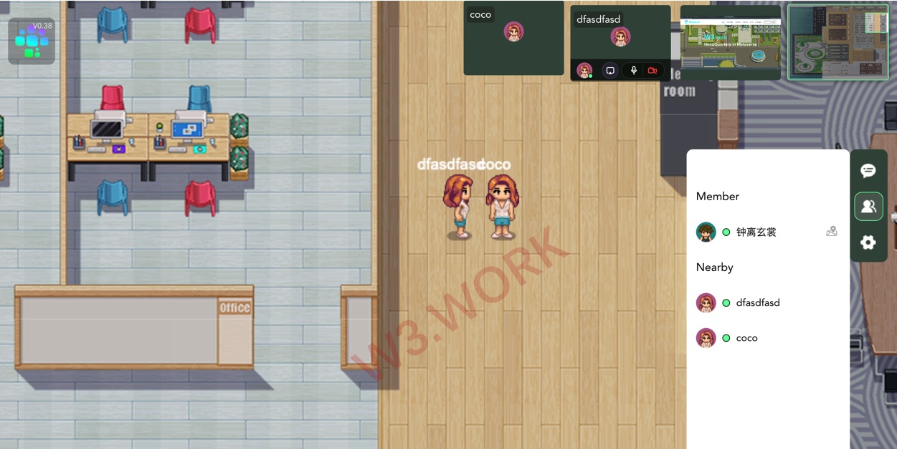
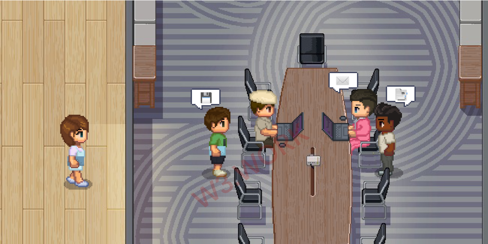

# ❤ Features of Working in W3work

* **Screen Share** allows you to share your device screen or a specific application with remote audiences during live sessions. To alleviate the long-distance difficulty, you can share your screen with a colleague when teaching, training, or working online.&#x20;

* **Pomodoro Focus Corner** is a dedicated area for those who need to concentrate on a project and don't want to be disturbed. A timer would be set to divide work into intervals, and all DMs, calls, emails would be automatically and temporarily blocked during that time.&#x20;
* **White noise** could also be used to assist users with concentration.&#x20;
* Each W3work office has at least 1 **Meeting room**. If you wish to host a meeting, you need to make a reservation and notify the attendees ahead of time. The meeting agenda will be shown on attendees' calendars as a reminder. The spokesman would be given a spotlight in the meeting room and could be heard by everyone in the room. Spotlighting is a feature used for presentations and meetings. When you stand under a **Spotlight** tile or are manually spotlighted by a Moderator, everyone in the room can hear and see you. Spotlight tiles allow one or more people to broadcast their audio, video, and/or screen to everyone in the room.&#x20;
* W3work **Digital Whiteboard** makes remote work easier by empowering the entire team to co-create together, it helps you explain the thoughts that are processed behind your designs clearly.&#x20;
* W3work **Calendar** allows users to create and edit events. Reminders for events can be activated, with settings for type and time. Other users can be invited to events, and event locations can be added. The visibility of special calendars can also be enabled or disabled by users.

