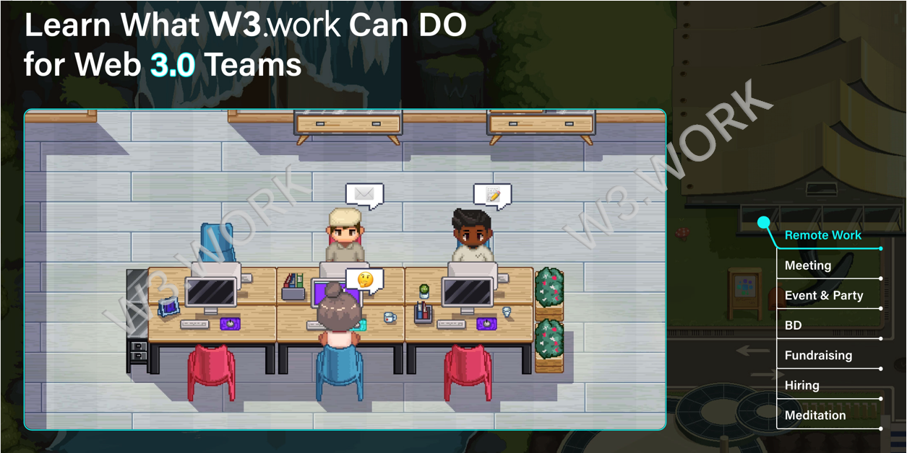

# 📚 W3work Overview

W3work, as its core, is an ecosystem for all Web3.0 professionals, with several main functions, including A/V meetings, Video Webinars, a 1-degree-of-separation mechanism to stay in touch with your previous and current Web3.0 colleagues, increasing and expanding business social networks, discussing business ideas, raising funds for startups, searching for jobs, looking for new hires, and much more.

W3work offers an exclusive platform for Web3.0 professionals, which not only provides them an opportunity to expand their social circle but also empowers creators with intuitive, powerful content co-creation tools.
