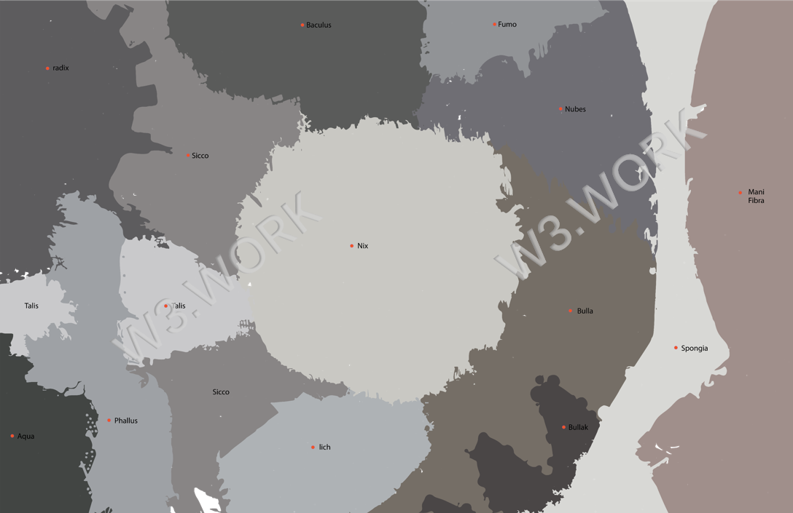

# 🌏 W3work Resort Guide

W3work is a fantasia resort for working, with a total size of 1,111,111 blocks (a Metaverse unit of land area) and a capacity to house more than 500,000 personnel.&#x20;

There are 5 different kinds of districts in W3work Resort, each district has a different characteristic and design style.&#x20;

W3work Resort has **a total of 11,111 office units**, the size of each office area varies from 500 to 10,000 blocks, and **the capacity of each office varies from 25 to 675 individuals**.
