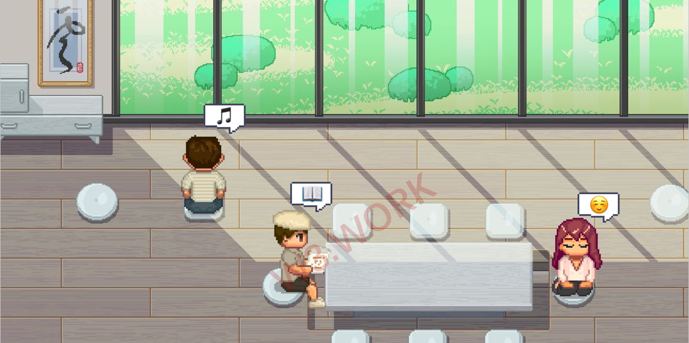

# 🎱 Facilities

🛎 **Concierge**: Each district in W3space has a concierge in the center, where you may reach out to W3space staff for assistance and suggestions at any time.&#x20;

**🏚 Announcement & Advertisement Board**: Each district has an Announcement & Advertisement Board in front of the concierge where Metaverse news, property management announcements can be posted for free. A specified ✨W3W is required if you want your post to be pinned.&#x20;

**🏋🏿 Wellness center**: Apart from gym equipment, the fitness center offers team-building activities such as basketball, rock climbing, and laser tag.

**🏞 Central Park**: Let’s fall in love in Web3.0!&#x20;

🧘🏾‍♀️ **Zen Room**: Meditate while listening to soft music, run away from the craziness for the afternoon.

**🖼 NFT Gallery**: Check out the coolest art from the coolest Web3.0 artists!&#x20;

**📚 Library**: Let us together build the history of Metaverse in W3space!&#x20;

**👩🏼‍⚖️ City Hall**: Metaverse conferences, Annual Parties, and other exclusive activities are taken places in City Hall, a specific Ticket NFT is required.

**🍾 Rooftop**: Birthday parties, nightclubs, weddings… Feel free to use your imagination. Cafés, juice bars, bars… You know what this means.

W3space is more than just a place to walk around, it's also a place to call home in the Metaverse. **There is no place like W3space.**
