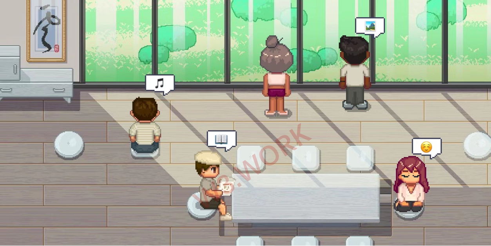
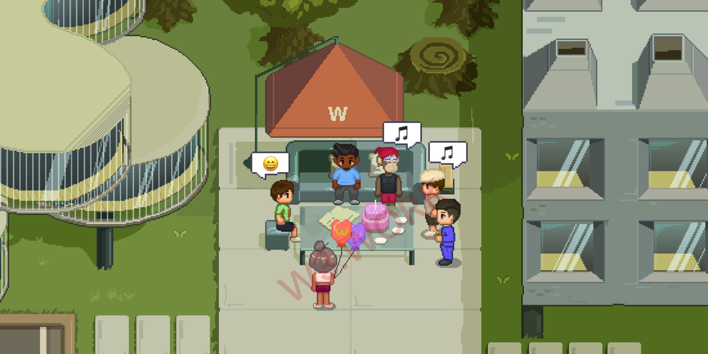

# 🌐 Web3.0 Social Networks

## 🔗 Expand Connections in W3work -- Anything Can Happen

* Certain sections in W3work are designed as **open areas**, where you can meet people from various Web3.0 firms, maybe even Vitalik. Who knows? You could throw a surprise birthday party on the rooftop for a colleague or friend, organize a small gathering party to expand your social network, or start a reading club. All talented freelancers and indie creators also have access to the open areas, even if they are not W3work residents, you might meet someone special, come up with a brilliant idea together, and collaborate on your next project.

* A **1-degree-of-separation** mechanism is used by the W3work Social Network Module. You could be introduced to any Web3.0 professionals you'd like to meet with a referral from your existed connections and a background check by W3work's innovative credit system.

* There are **open house events** once a month. Residents and freelancers at W3work could anticipate a guest visit to other accommodating companies. Companies in W3work can use a public calendar to choose the optimum time to open for visitors. W3work is home to a number of top-tier Web3.0 organizations and investment firms, providing terrific opportunities for users to network and improve.

## 👩🏻‍🏫 Announcement & Advertisement Board

Users can share their updates or express demands on the W3work broadcast and Announcement & Advertisement Board.&#x20;

* For example, if you're an artist and you don't have any teammates who can help with marketing and development, simply write '_Searching for Teammates_' on the board and wait for the ideal individual to approach you.&#x20;
* For example, if you're a freelancer seeking work, post your CV on the board, and when a position opens up, your name will be put in front of the recruiters.&#x20;
* Additionally, when a company is searching for talent, job descriptions would be posted on the board. If they are in urgent need, they can also pay a certain amount of ✨W3W to get the news pinned for everyone.
