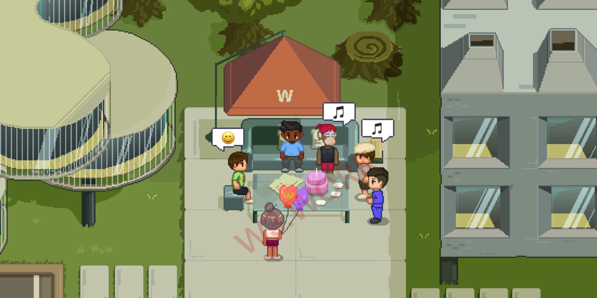

# 🔖 Brief Intro

W3space Asset Management is the first Web3.0 commercial real estate developer in the Metaverse. It is engaged in the development, management, and sales of Metaverse commercial properties, as well as investment, trading, consulting, and other Web3.0 commercial services.&#x20;

W3space Asset Management is building W3space into the Metaverse Headquarters, which will be located in the heart of Metaverse. It will officially open to the public by the end of 2022, while construction is still underway.

 (1).png>)

W3space is a fully decentralized, customizable, Multiplayer-Co-creation, online Web3.0 Video Teleconferencing software platform that combines entertainment, sociability and business. Web3.0 firms, venture capitalists, developers, and content creators can use W3space for everyday tasks, connecting and establishing social networks, developing and implementing growth opportunities among other organizations, exchanging cutting-edge ideas, hiring individuals, forming a temporary project team, looking for investment, or carrying forward the whole progress of Co-Creation in Web3.0.

