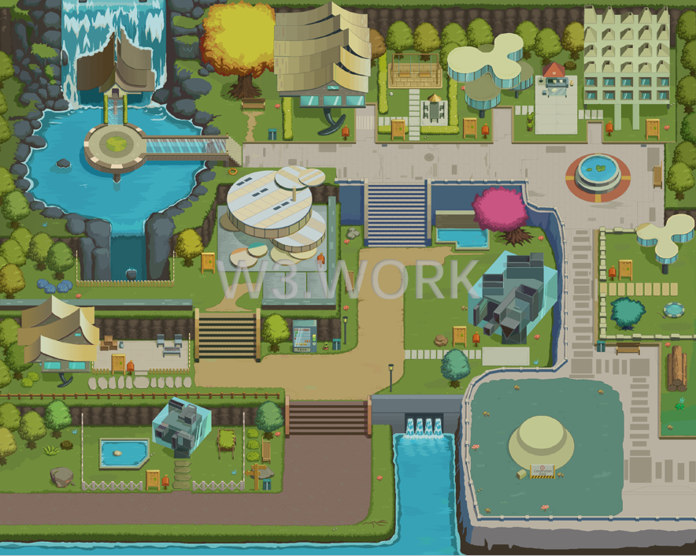

# 🍕 What is W3space?

W3space is a luxury commercial resort, with a total size of 1,111,111 blocks (a Metaverse unit of land area) with the capacity to house more than 500,000 individuals. Concert hall, mini-Golf courts, swimming pools, cafés, libraries, bars, central parks, and other open areas make up 30% of the site, making it ideal for Web3.0 professionals to congregate.

#### Reside and grow your business in W3work. Build your Metaverse virtual office in W3work.

W3space Residents can work remotely with their team, host business meetings, attend academic conferences, after-work parties, team building activities with coworkers, and have opportunities to connect and socialize with other Web3.0 practitioners, among other things.&#x20;

W3space owners can decorate and customize their office space, and then rent it out to Web3.0 professionals.&#x20;

Even if you don't own or rent a resort unit in W3space, you can still work, chill, experience, and wait for the unexpected in the open areas.

#### You could anticipate everything that would happen in a real-world working environment to happen in W3space, and you could also expect everything that’s surreal in your imagination to take place in W3space.
