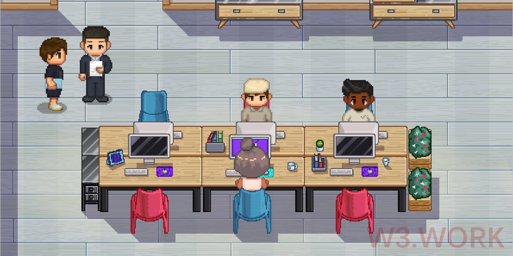

# 🎯 Market Solution

W3space Asset Management provides a decentralized platform for the growing number of Web3.0 communities and individuals to work for fun, connect, communicate, and collab with one another, expand their businesses, and so on.&#x20;

W3space Asset Management, on the other hand, is building an ecosystem to connect Web3.0 practitioners and empower indie creators by enabling them to reclaim control of their intellectual property and collaborate with the right partners to bring it to market.

