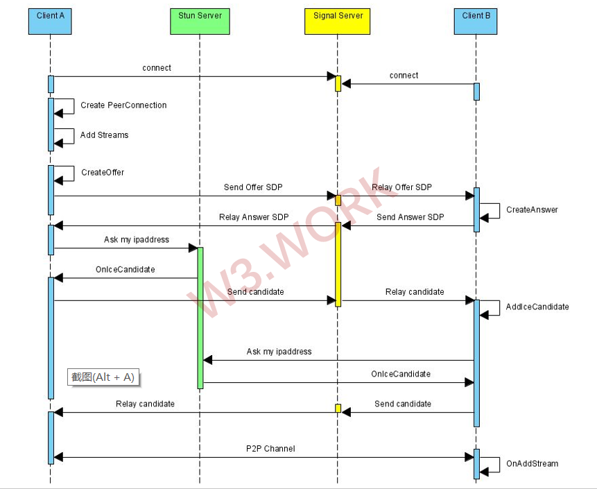
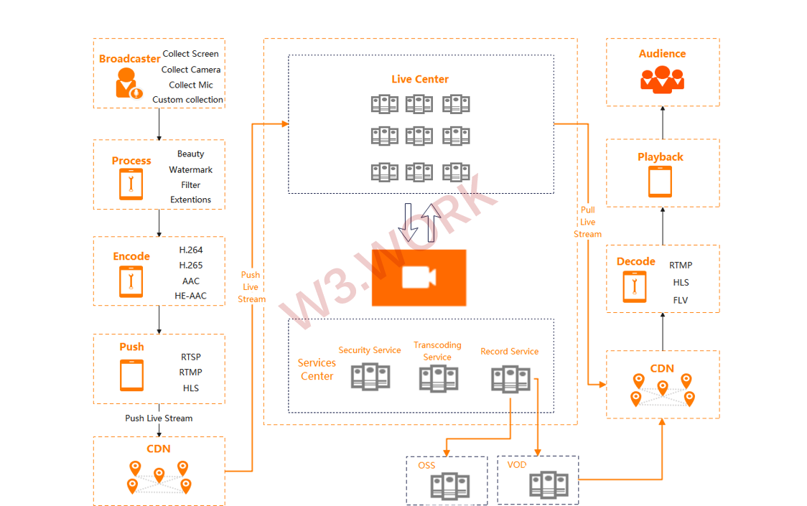

# 🥫 Decentralized A/V Services

.png>)

### Internal Communications&#x20;

The privacy of A/V information is one of the most critical considerations when it comes to internal communication. To prevent messages from being stolen on the centralized server, the typical technique is to encrypt them. However, because most users have no way of knowing whether their data is securely encrypted or not, they are forced to believe and accept the service.

W3work uses decentralized point-to-point communication while delivering A/V communication services inside the company, to completely address the rigorous needs of Web3.0 firms for data security. When the front-end sends a communication request, the contract will check if both sides are from the same firm and then automatically establish a point-to-point A/V connection using WebRTC, WebSocket, or SmartContract. As a result of this technical solution, data is only exchanged among internal company members, skipping the central server, and ensuring that no information is leaked.

###

## Public Communication&#x20;

When users perform public activities like attending conferences, AMAs, hackathons, socializing in open areas, and so on, the most critical needs are stability and high-quality communication connections, while the necessity for decentralization and privacy is decreased. We choose to deploy streaming media services based on AWS Media Services to better address the A/V communication demands of users during public activities. AWS Media Services, which is built on the most secure worldwide infrastructure, securely ingests and transmits video streams over the AWS global network with a few milliseconds of latency.

When hosting a large event in W3work with more than 200 attendees, no Fiat currency payment is required to cover the costs of servers, bandwidth, transcoding, or other services; instead, a set amount of ✨W3W or a set amount of future W3work Token is required, making W3work A/V streaming services are a much more cost-effective option than traditional ones.

W3work has implemented the NFT-based-Ticket. The host can issue NFTs as tickets to a large and exclusive activity, and only NFT-based-Ticket holders have access to the event and can correspond to A/V live streams.

.png>)

**Live Streaming Flow**

The anchor receives live content via the acquisition device, pushes the live stream via push streaming, and then pushes streams to the live broadcast center through edge push streaming. The pushed video stream is accelerated by CDN edge nodes to ensure the stability of the upstream transmission. The video stream can be transcoded and captured as needed when it is pushed to the live broadcast center. Through the CDN content distribution network, the processed video stream is subsequently transferred to the viewer's device for viewing.

### Collecting&#x20;

Images and audios are among the items to be collected. Camera videos, screen recordings, local video files, and other collection sources that need to be redefined and implemented are examples of image collection sources. Other input sources, such as microphones, system sounds, or local audio files, are configured for the audio collection source.&#x20;

### Processing&#x20;

After the video or audio has been collected, the original data is obtained. We usually process it before encoding and compressing it to improve some live effects or add some additional effects. Audio and video processing are both parts of the processing technique. Audio processing encompasses things like audio mixing, noise reduction, and sound special effects, among other things. Beauty, watermarking, and a variety of custom filters are all included in video processing.&#x20;

### Encoding and Encapsulation&#x20;

H.264 encoding is used to compress the video, and AAC encoding is used to compress the audio. Encapsulation can be thought of as a container for media, and it is a standard for mixing and encapsulating the multimedia content (video, audio, subtitles, chapter information, and so on) generated by the encoder.&#x20;

### Distribution&#x20;

* Push&#x20;

The audio and video data is collected and transmitted to the streaming media server using streaming media transmission protocols such as RTSP, RTMP, HLS, FLV, and etc., and large-scale streaming distribution can be achieved swiftly with the support of CDN.&#x20;

* Transmission&#x20;

Use CDN solution to efficiently reduce network transmission delay.&#x20;

* Pull&#x20;

Process transcoding into various formats, support multiple protocols such as RTMP, HLS, and FLV, and convert different streams to adapt to a variety of network conditions and terminal devices with varying resolutions.&#x20;

### Decoding&#x20;

Separate FLV and TS files from audio and video, then decode the audio and video respectively.&#x20;

### Playing&#x20;

Play with players based on protocols such as RTMP and HLS.
