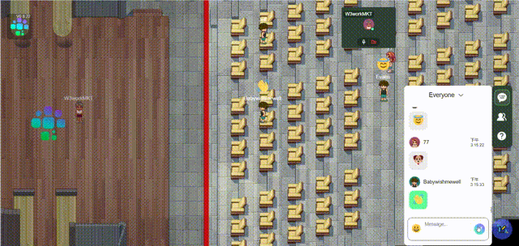

# 🚀 DEV UPDATES

## UPDATED VERSION 0.8.34 （Aug.23.2022) 

## UPDATED VERSION 0.8.3**3** （Aug.20.2022) 

#### Features

* **Toolbar**: The toolbar will automatically retract when you move or click in other areas.
* **Friendlist**: Adds the function of extending and collapsing the friend list; Displaying the group's membership number; Adjusts the contact pop-up box's width.
* **Mouse**: The mouse shape will alter once it’s above the interativable assets.

<figure><figcaption></figcaption></figure>

* **Conference Hall:** Optimizing the conference room stage design and adding a speakers podium.

<figure><figcaption></figcaption></figure>

## UPDATED VERSION 0.8.32 （Aug.14.2022) 

#### Features

* **LOGO**: Users can upload their logo while building standard and customized offices.
* **Button**: "Build My Office” button design has changed.

<figure><figcaption></figcaption></figure>

* **Customized Office**: adding the function of drag-and-drop image positioning.
* **Friend list:** While unfollowing,  the right side of the user name does not display “follow” by default, while mouse-on, the “Follow” button appears. While on the list of Nearby/Team, the “follow” button will be displayed. Mouse-on, “following users” will be displayed.

## UPDATED VERSION 0.8.31 （Aug.10.2022) 

#### Bug Fixes 

* **Displaying**: Number of people displaying problems in the hot zone.
* **Displaying**: Message displaying problem.
* **Meeting Room Date**: “Project Manager” adds the function of checking period while setting up a meeting room.

## UPDATED VERSION 0.8.30 （Aug.05.2022) 

#### Bug Fixes 

* **Location**: Fix the problem of being mislocated by entering an office.&#x20;
* **Speech Bubble**: Optimization.

#### Features

* **Meeting Mode**: Adding broadcast mode and brainstrom mode to the conference room. Attendees can interact and communicate with each other during the break.

W3.work presents you with our Open-World concept art with the following practical features.

#### FEATURES 

*   **Avatar**: When you enter W3.work for the first time, you will need to choose your avatar, the digital character that represents you in W3.work.

    An avatar has certain specifications and format and comes with a default set of animations.
* **A/V chatting**: When users are within a particular range, A/V chat will be automatically established without risks of data leakage due to the P2P connection technology.

.gif>)

* **Streaming**: Project teams can reserve the Conference Room to set up a steady live feed with plenty of spectators. The organizer can perform a number of tasks using W3.work, such as flexible broadcasting control, temporary speaking, bans, and kick-outs.

* **Private Office**: Project teams can request to have a private office built where they can work, chat, collaborate on a whiteboard, hold meetings, relax with gaming devices, and use other interactive features.
* **Customization**: W3.work office owner is now allowed to upload objects and make decorations in his workspace.
* **IM**: Public, nearby, and private channels are all available for text conversation. Over the local channel's decentralized connection, you can send files in any format.

## UPDATED VERSION 0.8.29 （Aug.04.2022) 

#### Bug Fixes

* **Location:** Fix the problem of being mislocated by entering a personal office.

## UPDATED VERSION 0.8.28 （Aug.03.2022) 

#### Bug Fixes

* **Connection**: Fix the problem of occasional connection errors.

## UPDATED VERSION 0.8.27 （Aug.02.2022) 

* Adding "Team List": Entering an office space, the Team List appears.
* Adding "Follow" Function.

## UPDATED VERSION 0.8.26 （Aug.01.2022） 

#### Features

* Adding Speech Bubbles to characters
* Allowing users to build their own Standard Office and Customizable Office

.png>)

## UPDATED VERSION 0.8.25 （Jul.26.2022） 

#### Bug Fixes 

* **Connection**: Fix the problem of occasional connection errors in the meeting room.
* **Loading**: Simplify the code and optimize the loading speed.

#### Features 

* **Emoji**: Emojis that have been sent in the public channel are shown above an avatar.

#### BREAKING CHANGES 

* **Customization**: W3.work office owner is now allowed to upload objects and fully customize his workspace.
* **File**: Users can send files in any format over a decentralized connection in the nearby channel.

## &#x20;

