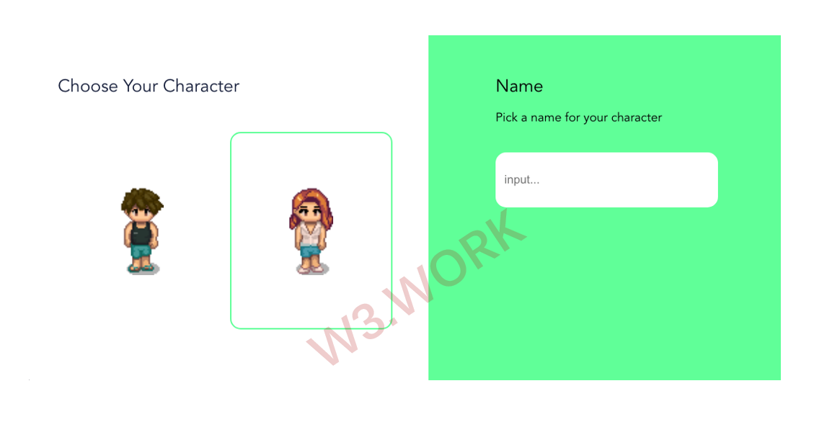

# 🥰 Customize Your Character

When you enter W3space for the first time, you will need to choose your avatar, the digital character that represents you in W3space, which can be modified piece by piece by the owner in the official version.&#x20;

An avatar has certain specifications and format and comes with a default set of animations such as walking, running, jumping, and sitting.&#x20;

Specifically, this avatar is modifiable piece by piece, including but not limited to, glasses, hats, makeup, torso, legs, and shoes.&#x20;

In our 1.0 Version, you can choose your outfits designed by W3space cooperating fashion designers for free. We'll collab with more fashion brands and design studios in our 2.0 Version to provide more options for our users.&#x20;
