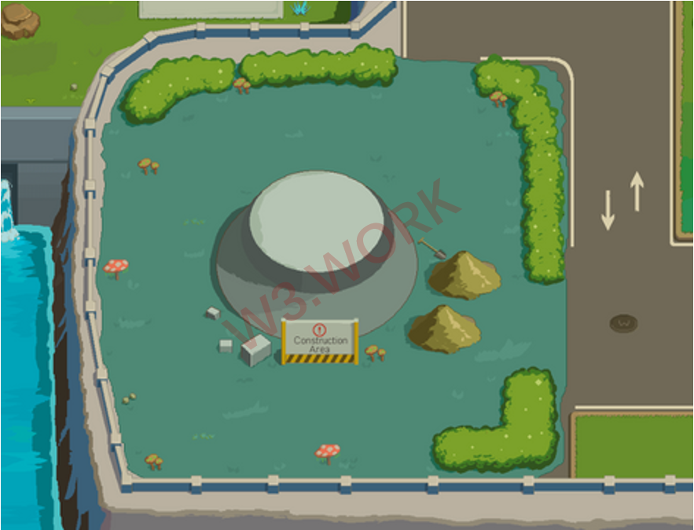

# 🏗 Office Decoration

> **Unit owners and residents can renovate and decorate their offices.**

* Decorations can be conducted by W3work Property Management and a certain amount of ✨W3W will be charged as a decoration fee.
* Residents can also perform their own decoration after a half-day of shopping in W3work Furniture Decor3, which can undoubtedly help you build your ideal office space.
* Residents could hire W3work Professional Outsourcing Studios as well, depending on the requirements and budget. Outsourcing Studios can design completely customized surroundings as needed, the cost of decoration will be determined according to the specific requirements.
