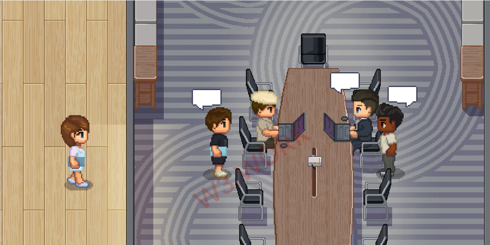
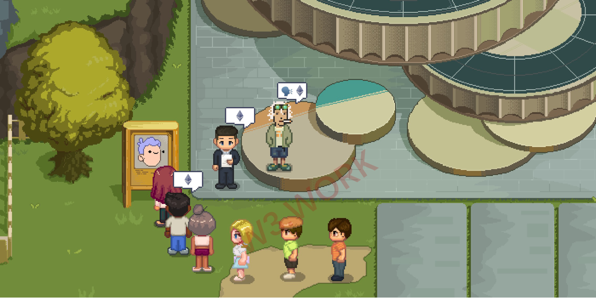
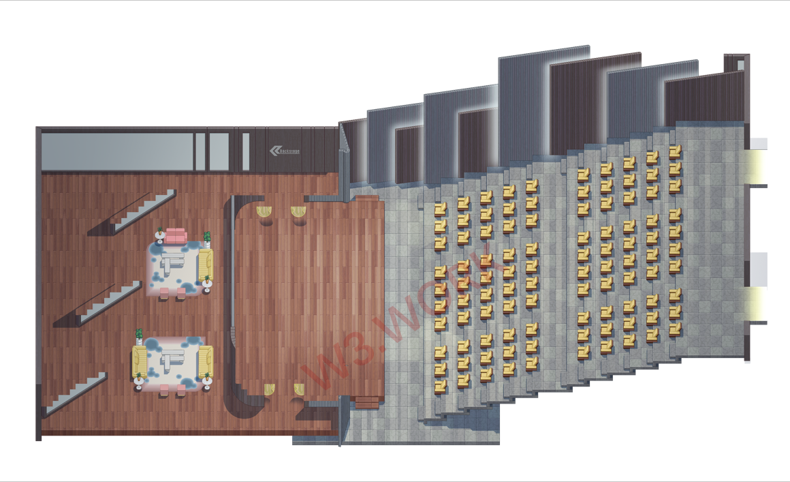

# 💬 Working Experiences in W3work

#### Example 1 - If you are a Web3.0 Recruiter&#x20;

If you need to employ a contract developer right away, you can post your job description on the Announcement & Advertisement board. If it's urgent, you can pay an additional charge to have it pinned so that everyone in W3work sees it.&#x20;

In the interim, you may search through W3work Talent Bank to see if there are any qualified profiles of recent job seekers.&#x20;

After that, you can schedule an interview with him or her. A job interview would be taken place in your W3work meeting room.

#### Example 2 - If you have a brilliant idea&#x20;

If you're an artist who has come up with a brilliant idea and wants to promote it and make it an NFT project, this is the place to be.&#x20;

You can walk into the concierge and post your requests for developers and marketers on the Announcement & Advertisement board.&#x20;

W3work offers a variety of integrated solutions to help you boost the productivity of your remote team members once you've built one.&#x20;

#### Example 3 - Once you have started a project&#x20;

What should you do now that you've started a project and rented an office unit in W3work for yourself and your team members?&#x20;

Make an appointment with a W3work resident who specializes in investing and fundraising, and pitch your proposal to them by organizing a meeting.&#x20;

#### Example 4 - Want to expand your business?&#x20;

.png>)

You've already launched a project smoothly and want to market your brand by cooperating with additional projects or studios?

The simplest way to accomplish it is to make a reservation and pay a visit to their office in W3.Work.&#x20;

#### Example 5 - If you want to talk to the project owner&#x20;

If you have some fantastic ideas to share with a project manager, write them down and hand them over to a W3work staff at the concierge or go directly to their office resort and deliver your note into their mailbox.&#x20;

#### Example 6 - If you are an artist

If you're an artist, you can host an art exhibition right in your W3work office. Simply set up some exhibition walls for displaying in the office, decorate them as you see fit, and hang art that you are proud of. You're ready to go once you've sent out some invitations and gotten your RSVPs.

W3work also offers you access to our opulent **Art Gallery**. Artists can submit their best work for consideration by the W3work DAO Committee to be displayed in the **Gallery**.

**Example 7 - If you are a Dev**

If you're a developer and want more people to see your code than simply on Github, W3work would also fill that demand and establish a special subverse for developers working in the Web 3.0 space. Show off your code with pride and let your peers know when you're confused.

**Example 8 - If you want to host an AMA**

You can arrange the Town Hall to organize an AMA with hundreds or even thousands of your audience, regardless of whether you are an influencer or the project owner.

